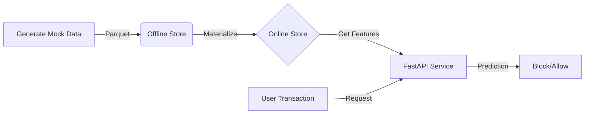

# 🛡️ Real-Time Fraud Detection with Feast

[](https://feast.dev/)
[](https://fastapi.tiangolo.com/)
[](https://www.python.org/)

Scale your fraud detection capabilities from batch to real-time with **Feast (Feature Store)**. This project demonstrates a production-grade pattern for serving consistent feature data to your fraud models with low latency.

## 🚀 Why Feast?

In fraud detection, **latency is money**. You need to decide whether to block a transaction in milliseconds. To do this, your model needs fresh features (like *"number of transactions in the last 10 minutes"*).

Feast bridges the gap between data engineering and ML by:
1.  **Serving consistent features** for both training (offline) and serving (online).
2.  **Reducing training-serving skew** ensuring your model behaves the same in production as it did in training.
3.  **Providing low-latency retrieval** via an online store (e.g., Redis, DynamoDB - *SQLite used here for demo*).

### 🌍 Feature Store Landscape
While Feast is the leading **open-source (DIY)** option, it's helpful to understand where it fits:

| Type | Examples | Pros | Cons |
| :--- | :--- | :--- | :--- |
| **Open Source** | **Feast**, Hopsworks (Community), Featureform | Free, Cloud-Agnostic, flexible infrastructure, no vendor lock-in. | Requires self-management and DevOps effort. |
| **Cloud Native** | AWS SageMaker FS, Vertex AI FS (GCP), Databricks FS | Fully integrated, easy setup if you are already in that ecosystem. | Vendor lock-in, can be expensive, limited standalone features. |
| **Enterprise Managed** | Tecton, Chalk.ai, Fennel | Complete platforms with UI, governance, and SLA. Tecton is built by Feast creators. | Expensive licensing, less custom control. |

**Why specificially Feast?** It allows you to build a bridge between your data warehouse (Snowflake/BigQuery) and your serving layer (Redis) without buying into a massive proprietary platform immediately.

## 🏗️ Architecture



## 🛠️ Installation & Setup

### 1. Prerequisites
*   Python 3.9+
*   [`uv`](https://github.com/astral-sh/uv)

### 2. Clone & Install
```bash
git clone https://github.com/zamboosh/real-time-fraud-detection-feast.git
cd real-time-fraud-detection-feast/fraud_feature_store

# Create a virtual environment and install dependencies
uv venv
source .venv/bin/activate
uv add feast fastapi uvicorn pandas numpy pyarrow pydantic
```

### 3. Initialize Feast
Register your feature definitions and set up the store.
```bash
cd feature_repo
feast apply
```

### 4. Remove example_repo.py (not needed for this demo)
```bash
rm example_repo.py
rm data/driver_stats.parquet
```

### 5. Generate Training Data
Generate mock transaction data to populate your offline store.
```bash
uv run scripts/generate_transactions.py
```

> **Note:** This creates a parquet file at `feature_repo/data/user_transactions.parquet` which acts as our "Data Warehouse" for this demo.

### 6. Load Data to Online Store
To serve features in real-time, we must "materialize" (load) data from the offline store (Parquet) to the online store (SQLite).
```bash
# Load data up to the current time
feast materialize-incremental $(date -u +"%Y-%m-%dT%H:%M:%S")
```

### 7. Run the Prediction Service
Head back to the root and start the API.
```bash
cd ..
uvicorn src.app:app --reload --host 0.0.0.0 --port 8080
```
*The service is now running at `http://127.0.0.1:8080`*

*The API docs are available at `http://127.0.0.1:8080/docs`*

## 💡 Usage

Make a prediction for a user. The system will fetch their recent transaction history from the Feature Store and decide if the new transaction is fraudulent.

**Example Request:**
```bash
curl -X 'POST' \
  'http://127.0.0.1:8080/predict' \
  -H 'accept: application/json' \
  -H 'Content-Type: application/json' \
  -d '{
  "user_id": 1005,
  "transaction_amount": 500.0
}'
```

**Expected Response:**
```json
{
  "is_fraud": false,
  "confidence": 0.5,
  "features_fetched": {
    "user_id": [
      1005
    ],
    "transaction_count_7d": [
      37
    ],
    "avg_transaction_amount_7d": [
      296.6175231933594
    ]
  }
}
```

## 📂 Project Structure

*   `feature_repo/`: The heart of Feast.
    *   `feature_store.yaml`: Configuration (pointers to registry, online/offline stores).
    *   `example_repo.py`: Python definitions of your features and data sources.
*   `src/app.py`: The application logic consuming features.
*   `scripts/`: Helper scripts for data generation.

## 🎓 MLOps Best Practices demonstrated here

1.  **Feature Definitions as Code:** All features are version-controlled in `feature_repo`.
2.  **Point-in-Time Correctness:** Feast handles the complex logic of joining features at the correct timestamp, preventing data leakage.
3.  **Decoupling:** Your model logic (`src/app.py`) is decoupled from data pipelines. It simply asks for "user features", and Feast handles the rest.

## 🔮 Road to Production

To take this to production:
1.  **Switch Online Store:** Change `feature_store.yaml` to use **Redis** or **DynamoDB** for sub-millisecond latency at scale.
2.  **Switch Offline Store:** Point to **BigQuery**, **Snowflake**, or **Redshift** instead of local parquet files.
3.  **Automate Materialization:** Use Airflow or Dagster to run `feast materialize` jobs periodically, keeping online features fresh.

---
